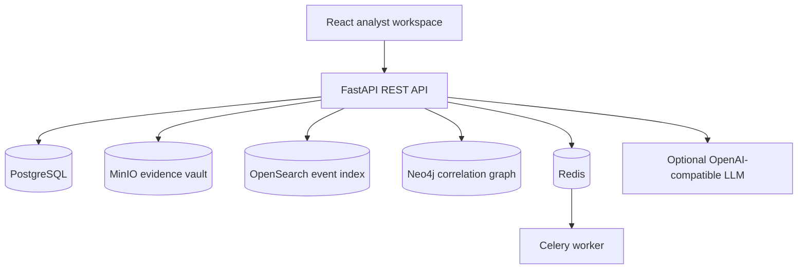
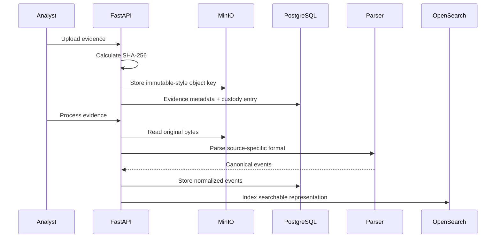
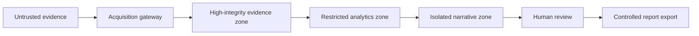

# Technical Architecture

## Runtime components



## Evidence processing path



## Traceability model

```text
Report
  → approved NarrativeClaim
    → Finding / Relationship
      → NormalizedEvent
        → EvidenceArtifact
          → MinIO object + SHA-256
            → CustodyEntry chain
```

## Service responsibilities

### Backend API

- Authentication and local JWT issuance
- Case workflow
- Evidence acquisition
- Integrity verification
- Synchronous parsing and analytics for the MVP
- Narrative generation and validation
- Report generation and download

### PostgreSQL

Authoritative structured store for users, cases, evidence metadata, custody entries, normalized events, findings, entities, relationships, claims, decisions, reports and audit events.

### MinIO

Stores raw evidence and report outputs. Object keys contain case ID, evidence/report ID and content hash. Production deployments should enable object lock, versioning, retention policy and external backup.

### OpenSearch

Derived search index for normalized events. PostgreSQL remains authoritative in the starter implementation. Production deployments should use a retry queue and reconciliation process.

### Neo4j

Derived entity graph. PostgreSQL stores the authoritative entity and relationship metadata, allowing graph reconstruction.

### Redis and Celery

Present as the background-processing foundation. The MVP endpoints execute synchronously for clarity; move expensive parsing, malware analysis, report generation and model inference to versioned Celery tasks in later releases.

## Trust zones



## Production gaps intentionally left for later

- Enterprise OIDC and phishing-resistant MFA
- Multi-tenant row/key/index isolation
- TLS for every service connection
- WORM/object-lock configuration
- Alembic migrations
- Signed custody manifests and reports
- Dedicated append-only audit sink
- Malware detonation isolation
- High-volume stream processing
- Model registry and model-risk governance
- Data retention and legal-hold engine
- Cross-region disaster recovery
